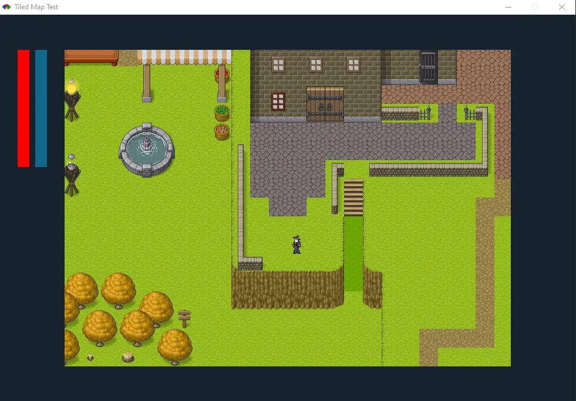

# Game-2d (desktop-game)

### Video preview:

### Client repository:
https://github.com/ghstd/pimacs_client

### Description:
Test project (in development), studying the capabilities of the 'gosu' library, is a 2d game in the rpg style, has a client and server part, assets are taken from: 'https://github.com/RSamaium/RPG-JS'.

### Resources used:
- https://github.com/RSamaium/RPG-JS
